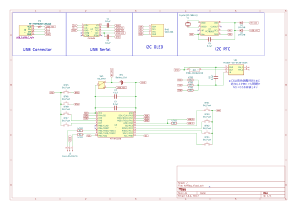
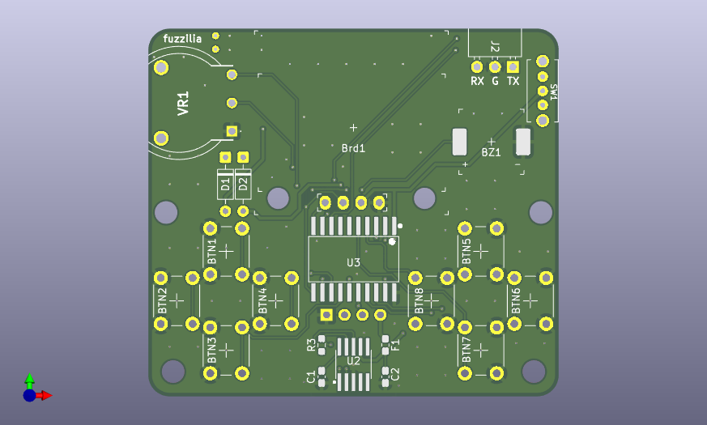
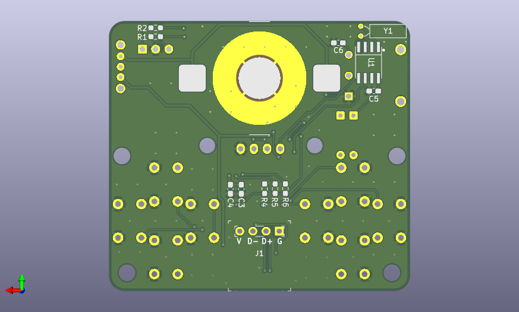

# AVRBoyの回路について

## 1. 回路図

AVRBoyの回路図は以下になっています。

## 2. 基板

AVRBoyの基板は以下になっています(※金色部分は実際の基板では銀色となります)。

- 基板表

- 基板裏

## 3. 部品

AVRBoyには以下の部品が含まれています。

|部位名|型番|個数|備考|
|---|---|---|---|
|マイコン|ATTINY3226-SU|1|メインとなるマイコン|
|OLED|128*64ドット有機ELディスプレイ|1|白色のみの表示|
|ボタン|タクトスイッチ(黒色)|8||
|スピーカー|PT86-091940LMR|1|表面実装用圧電スピーカー|
|ボリューム|RV100F-30-6K3B-B10K-B301|1||
|スライドスイッチ|スライドスイッチ SK-12D11VG3|1||
|電池ホルダー|BC-2001|1|CR2032用電池ホルダー|
|スイッチングダイオード|1N4148|2||
|RTC用IC|PCF8563T|1|クリスタルを用いたRTC用のIC|
|クリスタル|クリスタル(水晶発振子) 32.768kHz|1|RTC用|
|ヒューズ|リセッタブルヒューズ MF-FSMF020X-2|1|USB給電側のヒューズ|
|シリアル変換IC|CH340K|1|USB通信用のシリアル変換器|
|USB-C|USB-Cコネクタ基板|1|USB2.0接続のUSB-Cコネクタ基板|
|キャパシタ|0.1μFチップ積層セラミックコンデンサー|4|パスコン用(1608サイズ)|
|キャパシタ|47μFチップ積層セラミックコンデンサー|1|バルクコン用(1608サイズ)|
|抵抗|470Ωチップ抵抗|3|スピーカー用(1608サイズ)|
|抵抗|4.7kΩチップ抵抗|3|通信のTX,RX,UPDI用(1608サイズ)|
|ピンヘッダ|2.54mmピッチ ピンヘッダ1×4P|1|USB-Cコネクタ基板用ピン|
|ピンソケット|2.54mmピッチ ピンソケット 3P|1|通信用ピンソケット|
|金属ネジ|M2×8ネジ|2|OLED固定用|
|金属ネジ|M3×10ネジ|2|外装固定用|
|金属ナット|M2ナット|2|OLED固定用|
|金属ナット|M3ナット|2|外装固定用|
