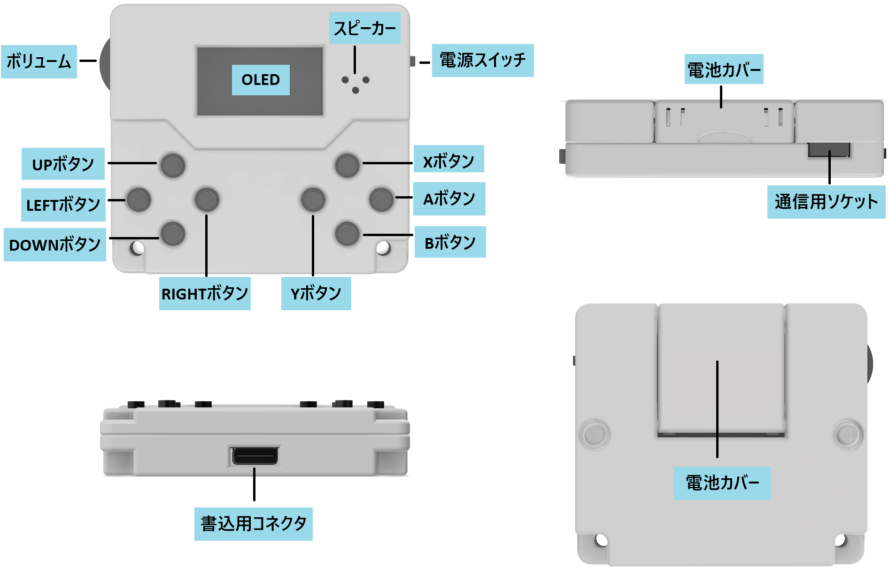
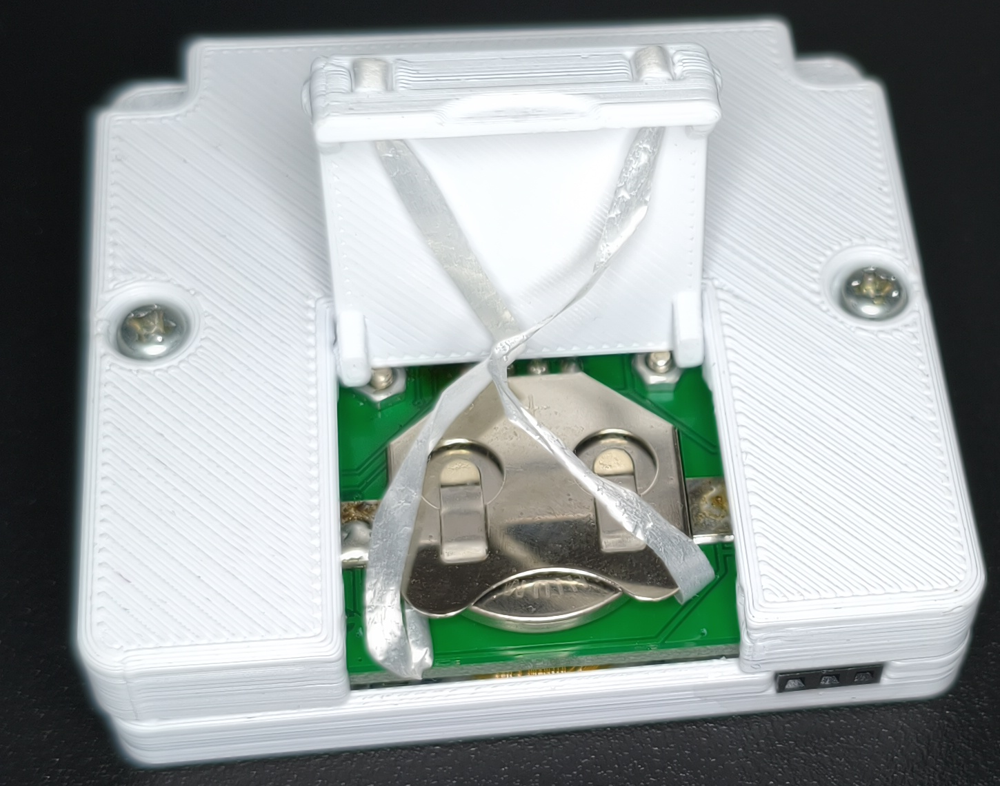

# AVRBoy説明書(v1.0)

## １：はじめに

本書はちょっとしたゲームも作れる電子工作プログラム練習ミニデバイス、AVRBoy(エーブイアールボーイ)の説明書です。
本書では簡単な利用方法について記載します。

AVRBoyは回路図など作成に必要な情報のほとんどをWebに公開しています。ページのリンクを記載していますので、詳しくはそちらを参照してください。

https://fuzzilia.github.io/avrboy/index

## ２：AVRBoyについて

AVRBoyはOLED、ボタン、ボリューム、ブザー、RTCの機能を備えたCR2032のボタン電池で稼働可能なコンパクトなミニデバイスです。
マイコンにはATTINY3226を使用しているため、Arduino IDEなどを用いた汎用的な開発が可能です。

## ３：注意事項

AVRBoyは1つ1つ手作りしているため、個体差があります。以下の点に注意してください。

- 免責事項について
  - 本デバイスの使用による損害について本サークルは一切の責任を負いませんのでご了承ください。
- 基板について
  - 基板のはんだ付けはすべて手作業で行っています。動作確認を行った上で梱包していますが、はんだ不良などが発生する可能性があります。
- 外装(ケース)について
  - 外装については積層型3Dプリンタで出力しています。ニッパーなどで極力取り除いていますが、バリなどが残っている場合や微妙な個体差が発生する場合があります。怪我などには注意して扱ってください。本製品により何かしら怪我などをした場合でも本サークルでは一切責任を追うことはできませんのでご了承ください。
- 廃棄について
  - 表側の外装の中には金属製のナットを埋め込んでいるため、廃棄する場合は外装も内部の基板も含めて不燃ごみ、またはお住みの自治体の小さい家電ゴミの破棄方法に合わせて廃棄をお願いします。

## ４：内容物

|名称|個数|備考|
|---|---|---|
|AVRBoy本体|1|サンプルプログラム書き込み済み|
|L字棒|1|電池取り出し用|

## ５：AVRBoyの各部名称

AVRBoyの各部構成は以下のようになっています。

### ・各部説明

|名称|説明|
|---|---|
|OLED|128×64ドットの白色OLEDの画面です。中間色は仕様上表示できません。|
|ボリューム|音量を調節するためのボリュームです。上に回すと大きく、下に回すと小さくなります。|
|スピーカー|圧電スピーカーです。音を鳴らすことができます。|
|電源スイッチ|電池で起動させる際の電源スイッチです。上にスライドさせるとON、下にスライドさせるとOFFになります。PCに接続する際は必ず電源スイッチをOFFの状態にしてから接続してください。|
|A、B、X、Yボタン|サンプルプログラムでは基本的にAで決定、Bでキャンセルや戻るなどの処理を割り当てています。X、Yについてはサンプルプログラムでは特に使用していません。|
|UP、RIGHT、LEFT、DOWNボタン|サンプルプログラムではカーソルの移動で使用します。|
|書込用コネクタ|ケーブルの差し込み口です。PCからAVRBoyにプログラムを書き込む時に使用します。書込用コネクタを使用する際は必ず電源スイッチをOFFにしてください。|
|通信用ソケット|AVRBoy同士で通信するためのソケットです。TX、GND、RXの3線を引き出しています。|
|電池カバー|回転式になっており、くぼみに指でひっかけて引き上げる形にすると開きます。|

## ６：電池交換について

AVRBoyはCR2032のボタン電池で稼働可能です。
本体背面の電池カバーを開くと、電池にアクセスできます。

カバー側にリボン紐が取り付けられているので、そのリボン紐の両端を引っ張ることで電池を取り出すことができます。

電池を入れる際は予めリボン紐を電池ボックス内に入れておき、そのリボン紐を電池ボックス内に押し込むような形で挿入してください。
こうすることで再度取り出す際にもリボン紐を引っ張るのみで電池を取り出すことが可能になります。

電池が取り出せなくなった場合は、同梱しているL字棒や爪楊枝など電気を通さない細いもので電池ボックスの隙間から押し出す形で取り出してください。

## ７：サンプルプログラム

AVRBoyでは予めサンプルプログラムが書き込まれています。AVRBoyのライブラリと書き込んでいるサンプルプログラムについては今後公開を予定しています。

Aボタンが決定、Bボタンはキャンセルや戻るなどに使用し、UP、RIGHT、LEFT、DOWNの4ボタンは選択する時などに使用するように設定しています。

|名称|内容|
|---|---|
|ミニゲーム|ジャンプとあんざんの2つのミニゲームを収録しています。ジャンプは流れてくる障害物に対してタイミングよくAボタンを押して飛び越えるゲームです。あんざんはフラッシュ暗算を行い正しい答えを選択するゲームです。|
|じこく|現在時刻を表示します。Aボタンを押すと時刻設定ができます。|
|ヘルプ|AVRBoyに関するトップページのQRコードが表示されます。|

## ８：プログラム書き込み方法

AVRBoyではPCとのシリアル通信の変換器としてCH340Kを使用しています。
予めPC側でCH340Kのドライバーをインストールした上で、AVRBoyとPCを接続してください。

AVRBoyへの書込み用のソフトウェアとしてAVRBoyWriterを作成しています。
以下のGitHubリポジトリのreleasesから最新のものをダウンロードし、READMEに従って使用してください。

- https://github.com/fuzzilia/avrboy-writer/releases

