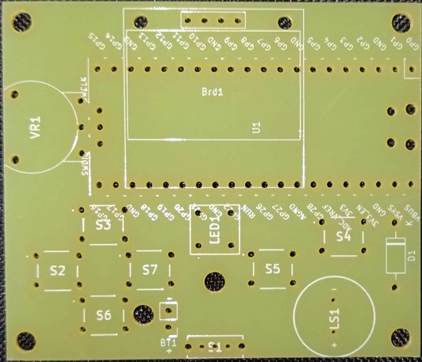
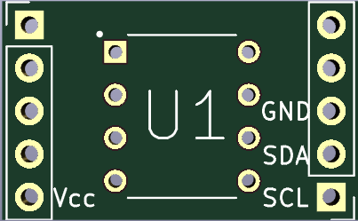
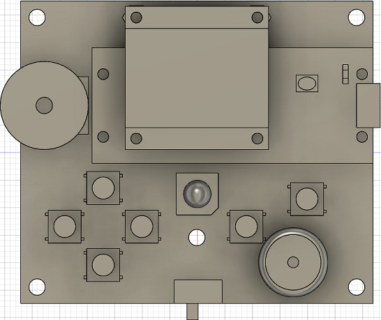
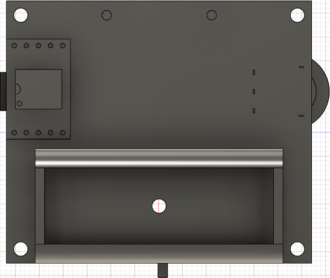

# RPicoBoyの回路について

## 回路図

RPicoBoyの回路は以下のようになっています。GPIOの位置は合っていますが、図にした時のレイアウトの問題により、GNDの位置のみ正しくない場合があるので注意してください。

## 基板

RPicoBoyの基板は以下の2種類を組み合わせています。

- メイン基板
  - メインとなる基板。不揮発性領域以外の全ての要素が入っています。

- 不揮発性領域基板
  - 不揮発性領域用の拡張基板。メイン基板に取り付けたRaspberry Pi Picoの裏側に取り付ける形になっています。

## 実装

実装時の各部品の配置は、以下のようになっています。

- 表側
  - OLEDはナットやスペーサーによりRaspberry Pi Picoの上に立体的に配置しています。

- 裏側
  - 不揮発性領域の基板はメイン基板から出ているRaspberry Pi Picoの足部分に更に付け加える形で配置しています。

## OLED

OLEDは128×64ドットの白色のものを使用しています。製品の仕様上中間色は表示できません。アドレスは規定値の「0x78」にしています。

## 不揮発性領域

シリアルEEPROMの「24FC256-I/P」を使用しています。最大で256kビット(32kバイト)のデータを保存できます。アドレス設定に必要なピンを全てGNDに接続しているため、アドレスは「0x50」にしています。
