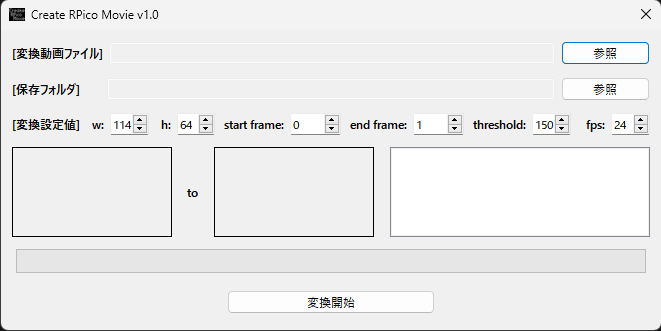

# Create RPico Movie

## Create RPico Movieについて

RPicoBoyで動画ファイルを再生するためのデータファイルを作成するツールです。

動画ファイルを読み込んで2値化し、指定フレーム分のドット画像を64bitの16進数配列のデータとして出力します。

以下のURLからダウンロードできます。

- https://github.com/fuzzilia/create_rpico_movie/releases

## 使い方

1. 「変換動画ファイル」の参照ボタンをクリックして変換したい動画を読み込みます(mp4, mov, avi, webmに対応)。

2. 「保存フォルダ」の参照ボタンをクリックして変換後ファイルの保存フォルダを指定します。

3. 「変換設定値」の各値を入力します。各設定値の説明は以下の通りです。

|名称|内容|初期値|備考|
|---|---|---|---|
|w|変換後の幅|114|デフォルト値は元動画が16:9の場合に合わせています。|
|h|変換後の高さ|64|デフォルト値は元動画が16:9の場合に合わせています。|
|start_frame|変換開始フレーム|0|動画の最初のフレーム番号が0。この値を変更するとプレビュー画像も更新されます。|
|end_frame|変換終了フレーム|動画の最終フレーム番号|この値を変更するとプレビュー画像も更新されます。|
|threshold|2値化する閾値|150|この値を変更するとプレビュー画像も更新されます。|
|fps|変換後fps|元動画のfps(整数値)|元動画のfpsが小数の場合は整数値に変換(23.98の場合は24で計算)。設定値は「元fps / 設定fps」の結果が割り切れるものしか設定できません。例として元動画が24fpsの場合は24, 12, 8, 6, 4, 3, 2, 1のいずれかのみ設定可能でそれ以外の場合はエラーとなります。|

4. 「変換開始」ボタンをクリックして変換処理を開始します。変換フレーム数が多い場合は時間がかかるので注意してください。

5. 変換終了後、ダイアログが表示され正常終了すると保存フォルダに「MovieData.h」ファイルが作成されます。

6. RPicoBoyの動画再生サンプルスケッチに「MovieData.h」ファイルがあるので作成したファイルで上書きします。

7. サンプルスケッチをRPicoBoyに書き込むことで変換したファイルをドット絵の動画として再生できます。

## 注意

- 1フレーム毎の画像をドットの配列として保存するため、fpsが高い、または長尺の動画についてはRPicoBoyへの書き込み時に容量不足によってエラーとなる場合があります。おおよその目安としてwが114、hが64の24fpsで90秒程度が容量の限界値となります。
- 16:9の動画はwが114、hが64で最適化しているため、その他のサイズではRPicoBoyでの再生時に意図しない形で再生される場合があります。
- 変換処理実行中はCPU使用率が100%になるため、他のアプリはできるだけ開いていない状態で実行してください。

## その他

詳細な情報やソースコードについては以下を参照してください。
- https://github.com/fuzzilia/create_rpico_movie
