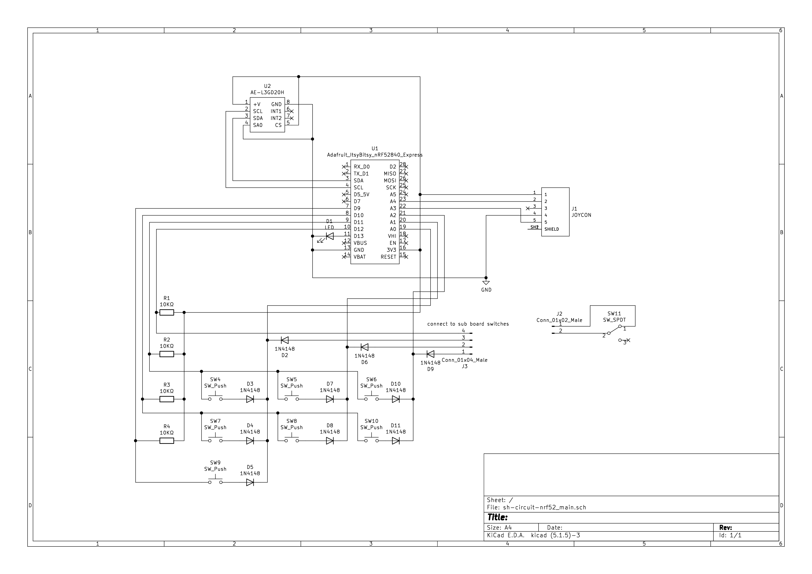
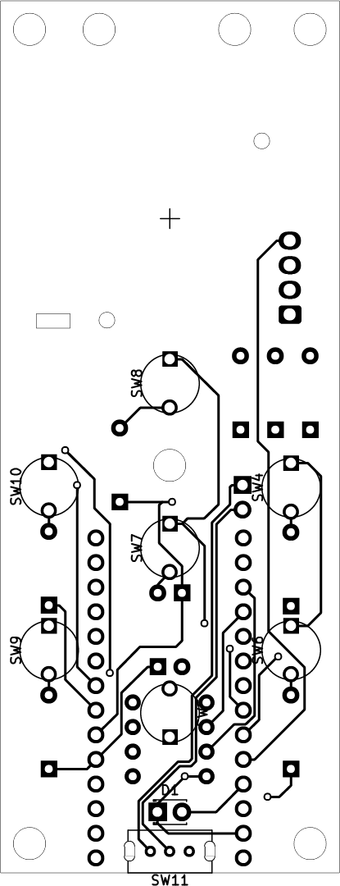
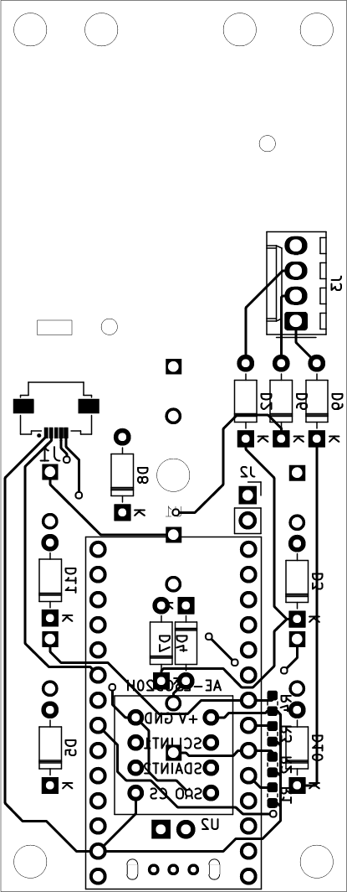
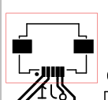
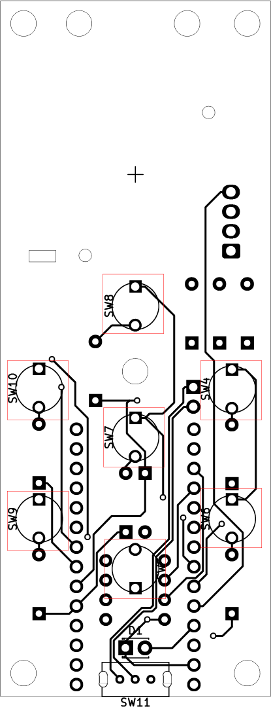
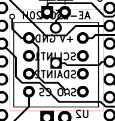

# 基板解説
SH-Controller(Secondary hand controller) の基板まわりのことについて解説をします。

基板自体はメイン基板とサブ基板の2枚構成で作成しましたが、サブ基板についてはスイッチのみなので割愛します。  
今回の基板は横幅が35[mm]、縦幅が90[mm]で作成しています。joystick がある程度場所を取ったのと、ボタン数がメイン基板だけで7ボタン使うことにしたので縦長になっています。  
下記ではそれぞれ使用したパーツについて解説を行います。

## 回路図

今回作成した基板の回路図はこのようになっています。

## 基板画像

上の画像はそれぞれ基板の表面(左)と裏面(右)のパターンです。細い実線はカット線となっていて穴が開けられています。

## ジョイスティック
まずは入力の一つ目にあたるジョイスティックについて解説します。

基板裏面側の中央左に配置してあるコネクタがジョイスティックに繋がるコネクタです。
今回使用しているコネクタはAliexpress で販売しているもので、2軸のアナログセンサーになります。また、Nintendo Switch と互換性があると書かれているものなのですが、詳細は不明です。  
ジョイスティックからはFPC ケーブルがのびているのでそれが受けられるコネクタを使う必要があります。

ここで使用するコネクタは「molex 505110-0592」になります。  
接続については図のように配置した場合にコネクタの左から
1. Horizontal Axis
1. Ground
1. Button
1. Vertical Axis
1. VCC(3.3Vで確認)

となります。ただし、Button に関しては使ってみたところ応答を得られなかったので使えないです(押し込みはできるがボタン入力としてはなさそう？)。もし使い方を知っていたら教えて欲しいです。  
また、Axis についてはとりあえず判別のために水平軸と垂直軸と名前を付けていますが、どっちがどっちなのかは分かりません。とりあえず2軸あってそれぞれの値が得られるとだけ理解しておけば良いかと思います。

Axis で取得できる値ですが、センターに位置しているときに大隊入力電圧の半分くらいの電圧となり片方に倒すと電圧が低く(0に近く)なり、反対側は電圧が高く(入力電圧に近く)なります。  
これをアナログ入力などで受けてあげればstick の状態を得ることができます。

ジョイスティック自体についてはこんなものですが、このコネクタを手はんだで実装するとなるとちょっとだけ気を付ける必要があります。このコネクタははんだ付けが必要なピンピッチが0.5[mm]と幅がすごく狭いです。  

そこで必要になるのがフラックスです。効果や性能、使い方などについては調べれば出てくるので割愛しますが、自分はHOZAN のH-722 を使っています。  
また、隣同士のピンがはんだでつながったとしてもはんだ吸取線を使うことで復帰はかのうです。

## スイッチ
もうひとつの入力の各スイッチについて解説します。

図の四角で囲ったものがそれにあたります。  
使用したタクトスイッチは千石電商で購入できる「SKRGAQD01」です。
今回ボタン数が10個と多いため、ボード上の入力ピンが足りないので、キーマトリックスとして実装しました。

## ジャイロ
今回製作した基板は拡張性としてジャイロを実装できるようにしています。

ここで実装できるものは秋月電子で購入できる「Ｌ３ＧＤ２０Ｈ使用３軸ジャイロセンサーモジュールキット(通販コード：K-15096)」を想定しています。

配線はI2C で繋いでいて、接続は下記のとおりです。

|Adafruit ItsyBitsy nRF52840 Express|AE-L3GD20H|
|-|-|
|3V|+V|
|SCL|SCL|
|SDA|SDA|
|GND|SA0|
|3V|CS|
|-|INT1|
|-|INT2|
|GND|GND|

L3GD20H はCS のHIGH - LOW でモードが変わり、HIGH にするとI2C モードで使え、LOW にするとSPI で使えるようになります。
