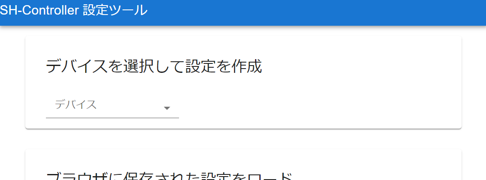
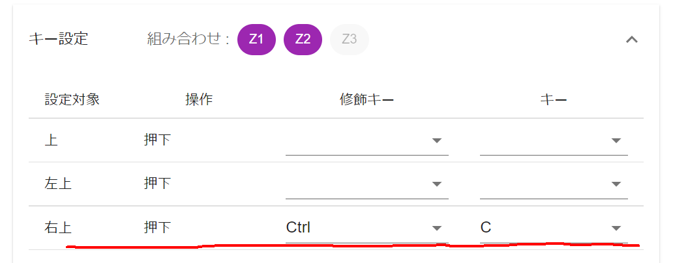

# SH-Controller 説明書

## はじめに

本書はお絵かき補助入力デバイス作成キット、SH-Controllerの説明書です。
本書では簡単な利用方法について記載します。

SH-Controllerはソースコードや回路図など作成に必要な情報のほとんどをWebに公開しています。
下記ページにリンクを記載しておりますので、詳しくはこちらを参照してください。

https://fuzzilia.github.io/sh-controller/index.html

## 各部の名称

SH-Controllerはこのような構成になっています。名称に※のついたものは次のページ以降で詳しく説明をします。

### 電源スイッチ

左にスライドさせると電源をON、右にスライドさせると電源をOFFにできます。

ただし、USBケーブルから給電しているときは、電源スイッチの状態にかかわらず電源ONの状態になります。

### LED

緑色のLEDが設置してあり、発光の仕方によってSH-Controllerの今の状態を知ることができます。

|光り方|状態|
|---|---|
|消灯(一切光ってない)|電源が入っていないか、電池が切れています|
|点灯(ずっと光り続ける)|利用モード(※1)で接続中です|
|点灯時間の短い点滅|利用モード(※1)で未接続状態です|
|点灯時間の長めの点滅|接続しました(接続完了時に3回だけ)|
|緩やかに変化する点滅|設定モード(※2)です|

- ※1 利用モード : 左手デバイスとして利用する通常のモードです
- ※2 設定モード : 設定の書き込みを行うモードです

### USBコネクタ

内部バッテリーの充電、およびファームウェアのアップデートに利用するためのUSBケーブルの差込口です。
モバイルバッテリーやPCに接続中はこのコネクタから給電して動作するため、有線で給電しながら動かすことも可能です。

### ねじ

このネジを外すことでSH-Controllerを分解することができます。
ネジは金属製のナットで受けているため、複数回の分解に耐えられるようになっています。

ただし、分解および組み立ての手順は複雑です。
これらの手順についての資料はありませんので、気をつけて行ってください。

## クイックスタート

### 設定の書き込み

まず、どのボタンを押せばどのキーが入力されるかの設定を専用の設定アプリを利用して行います。

対象のブラウザで下記URLを開いてください。 (Fuzziliaホームページから遷移できます。)

https://fuzzilia.github.io/sh-config/

このページの「デバイスを選択して設定を作成」から 「SH-Controller nRF52 v1」を選択し、キー入力設定を作成してください。
設定内容についての詳しい説明は設定ツールの使い方を参照してください。

設定を作成したら本体に書き込みます。
まず、本体のZ1ボタンを押しながらスイッチをONにしてください。本体の緑のLEDが緩やかに変化する点滅をしていれば設定モードで起動できています。

次に設定ツールのデバイス名の右側にある「接続」ボタンをクリックしてください。
すると、周囲にあるBluetoothデバイス一覧が表示されます。
この中のSH-CONFと表示されたものが設定モード中のSH-Controllerですので、こちらを選択してください。

その後、「接続」ボタンが「書き込み」ボタンに変化しますので、これをクリックしてください。
「書き込みが完了しました」のメッセージが表示されれば成功です。
「切断」ボタンをクリックし、本体の電源スイッチをOFFにしてください。

### ペアリング

今度は何もボタン押さずに本体の電源スイッチをONにしてください。
緑のLEDが一瞬チカっと光る点滅を繰り返していれば、利用モードでの通信待機状態です。

次に接続先の機器にてBluetoothの接続設定画面を開いてください。
接続可能な機器一覧にSH-CON2という名前があればそれがSH-Controllerですので、それと接続してください。
接続したタイミングでLEDが点灯時間の長めの点滅を3回繰り返した後点灯状態になります。

これで必要な設定はすべて完了です。
まずは接続先の機器でメモアプリやブラウザの検索窓などにフォーカスを当てた状態で本体のボタンを押してみて、設定通りのキー入力がされるかを確認してみると良いでしょう。

ここまで設定できれば、一度電源を切っても、再度電源を入れたときに自動的に接続されるようになります。

### 充電

USBケーブルでPCやモバイルバッテリー等に接続することで、内部バッテリーを充電することができます。
Adafruit製の充電回路を搭載しており、その保護回路により挿しっぱなしでも過充電になることはありませんが、充電中は強制的に電源ONとなってしまうため、充電が終わったらケーブルを抜くことをおすすめします。

ただし、現行の機種では充電完了を知る術が無いため、1時間の充電を目安としてください。

## 設定ツールの使い方

### 組み合わせボタン

設定ツールでデバイスを選んだ後は、最初に組み合わせボタンとして利用するボタンの選択を行います。
最大3個まで選ぶ事ができます。一つも選ばなくても構いません。

組み合わせボタンとは、それ以外の通常ボタンと組み合わせて押す事で、割り当てるキーの種類を増やすための仕組みです。
例えば、以下のように通常ボタンである左上に対して、2つの組み合わせボタンを組み合わせることにより、4種類のキー入力を割り当てることができます。

|組み合わせボタン|通常ボタン|キー入力|
|---|---|---|
|Z1|左上|A|
|Z2|左上|B|
|Z1+Z2|左上|Ctrl+C|
|なし|左上|Ctrl+Shift+A|
|Z1|なし|キー割当不可|

ただし、この例の最後の様に、組み合わせボタンだけを押すことに対してはキー入力を割り当てることができません。

### キー割り当てについて

キー設定は、一緒に押す組み合わせボタンの押し方毎に設定欄が分かれています。例えば、画像の例だとZ1とZ2を押しながら右上ボタンを押すとCarl+Cのキー入力する、という意味になります。

初期表示状態では組み合わせボタンを押さない、通常ボタンだけを押すパターンの設定欄のみが開いていますが、それ以外の組み合わせに対してキーを割り当てたい場合はクリックして設定欄を開いてください。

### スティックについて

SH-Controllerにはアナログスティックがついていますが、これにもキー入力を割り当てることができます。

スティックも通常ボタンと同様、組み合わせボタンと合わせて利用することで複数のキー入力割当を使い分けることができます。

現在、スティックの使い方は大きく分けて「回転タイプ」「方向ボタンタイプ」の2種類です。
初期設定は「回転タイプ」ですが、回転と表記されたセレクトボックスをクリックすると方向ボタンタイプに変更することができます。

#### スティックを「回転タイプ」で使う

スティックを倒して回転させ、キーの連打入力を行うタイプです。
時計回り、反時計回りに対してそれぞれキー入力を割り当てることができます。
例えばUNDO/REDOやキャンバスの倍率変更など、連打が必要で対になる操作が存在するようなショートカット入力におすすめです。

回転入力のときにだけ入力できる分割数は、1回転あたりいくつのキー入力をするかを指定するものです。
数が多いほど、連打数が多くなります。
ただし、利用しているデバイスの制約上そこまで連打が早くないので、大量のキー連打入力になると入力が溢れてしまいますので、注意してください。

#### スティックを「方向ボタンタイプ」で使う

スティックを特定の方向に倒すと対応するキーを入力するタイプです。
ボタンが足りない場合、こちらを利用することでさらに割り当てられるキーの数が増えます。
このタイプは分割数に応じて「4方向ボタン」「8方向ボタン」の2種類が存在します。
8方向ボタンは割り当てられるキーの数が多いですが、その分誤操作しやすいため、スティック操作になれてない人は4方向ボタンの方がおすすめです。

### データの保存について

設定内容はヘッダー入力欄の「ブラウザに保存」ボタンをクリックすることで保存することができます。
保存すると、初期画面の下側に保存したデータ一覧が表示されるようになり、そちらをクリックすると以前に作成した設定を再現した状態でキー割当設定画面を開くことができます。
保存したデータたからキー割当設定画面を開いた場合、「ブラウザに保存」を押すと以前のデータに対して上書きを行います。

このデータはブラウザ自体に保存されるため、設定を行ったPCの同じブラウザでしか利用できません。

設定をテキストデータとして書き出し、異なるPC間でやり取りする機能も検討中ですが具体的な予定は決まっていません。

## 部品表

本キットには、以下の部品が含まれています。

- メイン基板 (自作)
- サイド基板 (自作)
- 外装（3Dプリンタ製 PLA・M3ナット）
- Adafruit ItsyBitsy nRF52840 Express - Bluetooth LE
- Adafruit LiIon/LiPoly Backpack Add-On for Pro Trinket/ItsyBitsy
- Lithium Ion Polymer Battery - 3.7v 150mAh
- 丸ピンICソケット (14ピン×1列) 2.54mmピッチ
- 丸ピンIC連結ソケット 両端オスピン (14ピン×1列)
- molex 505110-0592
- 基板垂直取付用ブロック 6mm角(4個入り)
- 精密薄膜チップ抵抗器(1608 10kΩ 100個入)
- 小信号用汎用ダイオード
- スライドスイッチ
- タクトスイッチ(2P)本体高さ9.5mm
- タクトスイッチ・キャップ
- 2.5mmピッチ 5267シリーズ 基板用コネクタ ストレート 04P
- 2.5mmピッチ 5264シリーズ 基板用コネクタ ハウジング 04P
- 【2.5mm】5264シリーズ用コンタクトピン
- switch 互換のjoystick
- ＰＨコネクタ　ベース付ポスト　サイド型　２Ｐ　Ｓ２Ｂ－ＰＨ－Ｋ－Ｓ
- ＰＨコネクタ　ベース付ポスト　トップ型　２Ｐ　Ｂ２Ｂ－ＰＨ－Ｋ－Ｓ
- ＰＨコネクタ　ハウジング　２Ｐ　ＰＨＲ－２
- ＰＨコネクタ　コンタクト　ＳＰＨ－００２Ｔ－Ｐ０．５Ｌ　（１００個入）
- 抵抗内蔵５ｍｍＬＥＤ　５Ｖ　黄緑色　５７０ｎｍ　ＯＳＧ８ＮＵ５Ｂ６４Ａ－５Ｖ
- ネジ(ステン なべ M1.4x6)
- ナット(ステン M1.4)
- ネジ(ステン なべ M3x3)
- ネジ(ステン なべ M3x10)
- USBケーブル(A to Micro B)
