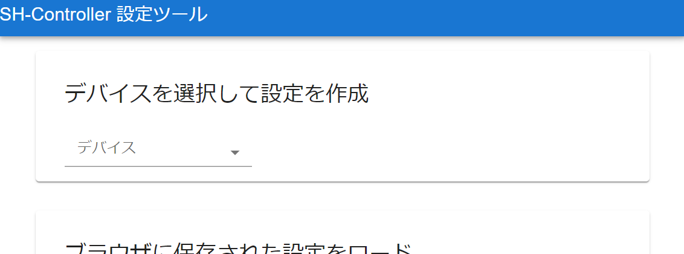
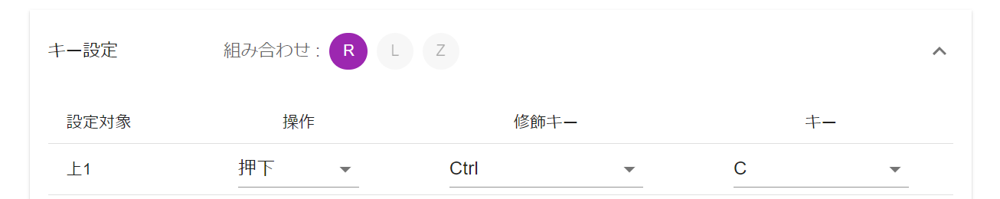
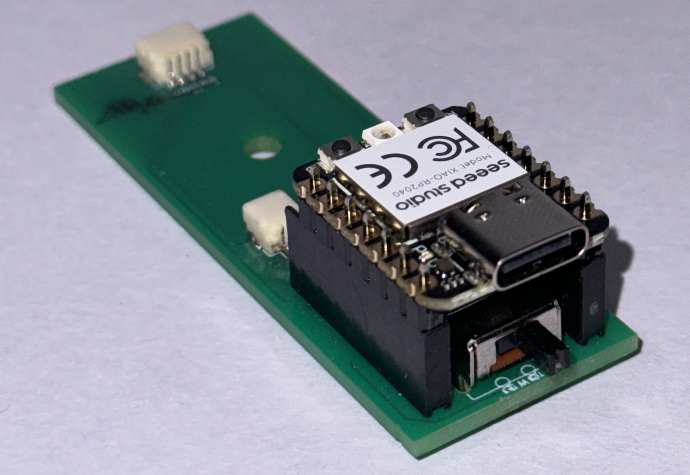

# SH-Controller 説明書

## はじめに

本書はお絵かき補助入力デバイス作成キット、SH-Controller v2 の説明書です。

SH-Controller はソースコードや回路図など作成に必要な情報のほとんどを Web に公開しています。
下記ページにリンクを記載しておりますので、詳しくはこちらを参照してください。

https://fuzzilia.github.io/sh-controller/v2

### IC の差し替えについて

SH-Controller v2 は、無線接続とジャイロ機能を追加できるように、ユーザー自身で IC を差し替えられるようになっています。
IC を差し替えると利用方法が変わる部分があり、説明書の各所で名前が出てきます。
そのため、はじめに IC の名前だけ説明します。

頒布時点では、Seeed Studio XIAO RP2040 がセットされています。これは 接続方法が USB ケーブルとなり、ジャイロは使えません。

これを無線接続にするには Seeed Studio XIAO nRF52840 を、加えてジャイロ機能をつけるには Seeed Studio XIAO mRF52840 Sense をご購入の上、差し替えを行って頂く必要があります。
それぞれの IC で利用可能な機能を以下の表にまとめました。

| 名称                             | 接続方法 | 電源           | ジャイロ |
| -------------------------------- | -------- | -------------- | -------- |
| Seeed Studio XIAO RP2040 (初期)  | USB      | USB            | なし     |
| Seeed Studio XIAO nRF52840       | 無線     | USB または電池 | なし     |
| Seeed Studio XIAO mRF52840 Sense | 無線     | USB または電池 | あり     |

具体的な差し替え手順はこの説明書の後半に記載しています。

### ファームウェアのアップデートについて

今後、fuzzilia ではバグ修正や機能追加を目的として、ファームウェアを更新する可能性があります。
その場合、fuzzilia の web サイト ( https://fuzzilia.github.io/ ) と X アカウント ( https://x.com/fuzzilia ) にて告知します。
ご自身でファームウェアをダウンロード、書き込みを行っていただくことで、最新版のファームウェアをお使いいただくことができます。

## 各部の名称と利用方法

SH-Controller はこのような構成になっています。

### 電源スイッチ

電源スイッチは IC を Bluetooth 対応のものに差し替えたときのみ利用します。

電池で動作させる場合には右にスライドさせると電源を ON、左にスライドさせると電源を OFF にできます。

※ USB ケーブルをコンピューター等に接続している場合は電源スイッチの状態に関わらず電源が ON になります。

### 電池蓋

電池は、Bluetooth 対応の IC に差し替えた場合のみ利用します。

電池蓋のボタンに近い部分を押しながら手前に引っ張ると蓋が開き、電池を入れることができます。
利用する電池は単４電池 2 本となります。アルカリ乾電池、ニッケル水素充電池が利用できます。

### LED

IC が乗っている基板のこの位置に LED があります。

初期の IC の場合は、電源が入っている場合に赤く点灯します。

Bluetooth 対応の IC の場合には、Bluetooth の通信状態などを LED の点滅や色で表示します。

### リセットボタン穴

IC の差し替えを行った場合に、ファームウェアを書き込む際に利用します。

Bluetooth 対応の Seeed Studio XIAO nRF52840 (Sense) はこの位置にリセットボタンがあるので、
この穴に爪楊枝の裏側などの細く先が平たい棒を差し込むことでリセットボタンを押すことができます。

初期の IC である、Seeed Studio XIAO RP2040 ではこちらは使いません。

### USB コネクタ

初期の IC で利用対象のデバイスや設定ツールを利用するコンピューターと接続するための USB ケーブルの差込口です。

IC を Seeed Studio XIAO nRF52840 (Sense) に差し替えた場合でも、ファームウェアの書き換えに利用します。

## クイックスタート

この章では、IC を差し替えていない状態での SH-Controller v2 の使い方を記載します。

### 設定の書き込み

まず、どのボタンを押せばどのキーが入力されるかの設定を専用の設定アプリを利用して行います。

設定アプリは WindowsPC、または Mac の Chrome ブラウザ、または Edge ブラウザでのみ利用できます。

対象のブラウザで下記 URL を開いてください。 (Fuzzilia ホームページからでも遷移できます。)

https://fuzzilia.github.io/sh-config/

このページの「デバイスを選択して設定を作成」から 「SH-Controller nRF52 v2 (右手用)」または「SH-Controller nRF52 v2 (左手用)」を選択し、キー入力設定を作成してください。
ジャイロ有と記載されたものは、IC をジャイロ機能有りのものに差し替えた場合のみ利用できます。
設定内容についての詳しい説明は設定ツールの使い方を参照してください。

設定を作成したら本体に書き込みます。
SH-Controller v2 を USB ケーブルで設定ツールを開いているコンピューターと接続してください。

次に設定ツールのデバイス名の右側にある「HID 接続」ボタンをクリックしてください。
すると、ポップアップで「SH-Controller v2」が選択できるようになりますので、こちらと接続してください。

MacOS の場合、最初の接続時に Chrome に対して入力監視の許可が必要になります。設定画面で許可をし、Chrome を再起動した後に再度同じ操作を行ってください。

その後、「接続」ボタンが「書き込み」ボタンに変化しますので、これをクリックしてください。
「書き込みが完了しました」のメッセージが表示されれば成功です。
「切断」ボタンをクリックして設定を終了してください。

MacOS の場合、初めて HID 接続をするときにデバイスの open に失敗した旨のメッセージ(英語)が出ることがあります。
このメッセージが出たら、コンピューターを再起動して再度試してみてください。
それでも失敗する場合、Karabiner などのキーボード入力を変換するようなソフトウェアをアップデート、アンインストールなどして再起動してみてください。

### 利用

上記設定書込み後、そのまま設定通りのキー入力ができるようになっています。
動作しないようであれば USB ケーブルを指し直してみてください。

以降、USB ケーブルで接続すればそのままキー入力デバイスとして利用できるようになります。

## 設定ツールの使い方

### 組み合わせボタン

設定ツールでデバイスを選んだ後は、最初に組み合わせボタンとして利用するボタンの選択を行います。
最大 3 個まで選ぶ事ができます。一つも選ばなくても構いません。

組み合わせボタンとは、それ以外の通常ボタンと組み合わせて押す事で、割り当てるキーの種類を増やすための仕組みです。
例えば、以下のように通常ボタンである上１に対して、2 つの組み合わせボタンを組み合わせることにより、4 種類のキー入力を割り当てることができます。

| 組み合わせボタン | 通常ボタン | キー入力     |
| ---------------- | ---------- | ------------ |
| L                | 上１       | A            |
| R                | 上１       | B         |
| L + R            | 上１       | Ctrl+C       |
| なし             | 上１       | Ctrl+Shift+A |
| L                | なし       | キー割当不可 |

ただし、この例の最後の様に、組み合わせボタンだけを押すことに対してはキー入力を割り当てることができません。

### キー割り当てについて

キー設定は、一緒に押す組み合わせボタンの押し方毎に設定欄が分かれています。例えば、画像の例だと R と L を押しながら上 1 ボタンを押すと Carl+C のキー入力する、という意味になります。

初期表示状態では組み合わせボタンを押さない、通常ボタンだけを押すパターンの設定欄のみが開いていますが、それ以外の組み合わせに対してキーを割り当てたい場合はクリックして設定欄を開いてください。

### スティックについて

SH-Controller にはアナログスティックがついていますが、これにもキー入力を割り当てることができます。

スティックも通常ボタンと同様、組み合わせボタンと合わせて利用することで複数のキー入力割当を使い分けることができます。

現在、スティックの使い方は大きく分けて「回転タイプ」「方向ボタンタイプ」の 2 種類です。
初期設定は「回転タイプ」ですが、回転と表記されたセレクトボックスをクリックすると方向ボタンタイプに変更することができます。

#### スティックを「回転タイプ」で使う

スティックを倒して回転させ、キーの連打入力を行うタイプです。
時計回り、反時計回りに対してそれぞれキー入力を割り当てることができます。
例えば UNDO/REDO やキャンバスの倍率変更など、連打が必要で対になる操作が存在するようなショートカット入力におすすめです。

回転入力のときにだけ入力できる分割数は、1 回転あたりいくつのキー入力をするかを指定するものです。
数が多いほど、連打数が多くなります。
ただし、利用しているデバイスの制約上そこまで連打が早くないので、大量のキー連打入力になると入力が溢れてしまいますので、注意してください。

#### スティックを「方向ボタンタイプ」で使う

スティックを特定の方向に倒すと対応するキーを入力するタイプです。
ボタンが足りない場合、こちらを利用することでさらに割り当てられるキーの数が増えます。
このタイプは分割数に応じて「4 方向ボタン」「8 方向ボタン」の 2 種類が存在します。
8 方向ボタンは割り当てられるキーの数が多いですが、その分誤操作しやすいため、スティック操作になれてない人は 4 方向ボタンの方がおすすめです。

### データの保存について

設定内容はヘッダー入力欄の「ブラウザに保存」ボタンをクリックすることで保存することができます。
保存すると、初期画面の下側に保存したデータ一覧が表示され、保存した設定を開くことができるようになります。

このデータはブラウザ自体に保存されるため、設定を行ったコンピューターの同じブラウザでしか利用できません。

## 右手用にする

SH-Controller v2 はボタン部を組み替えることにより、右手用に変更できます。
組み替えは、以下の手順で行ってください。

1. ボタン部の上から見える２本のねじを外す
2. ボタン部を上にゆっくりと少し持ち上げ、180 度弱回転させてはめ込み直す
   - 上手くはめられないようなら横から見てコネクタ部分が引っかかってないか確認してください
3. 再び２本のねじを締める
   - 樹脂製のねじのため、締めすぎにご注意ください

以上で右手用への組み換えは完了です。
設定も右手用のものを書き込めば、利用可能となります。

## 無線接続、ジャイロ入力機能を有効にする

はじめにで説明した通り、SH-Controller v2 は IC を差し替えることにより、無線通信機能やジャイロ機能を追加することができます。
ここでは、具体的な差し替えの手順を説明します。

### 必要な部品と道具を購入する

必要なのは Seeed Studio Xiao nRF52840 (Sense) ですが、ピンヘッダがはんだ付けされてない状態で販売されているので、はんだ付けをする必要があります。
細かい部品は添付しましたが、以下の工具と IC ついてはご自身でご購入ください。

- はんだごて
  - 電子工作や電子部品のはんだ付けに使えるもの
- はんだごて台
  - 上記のはんだごてを置いておく専用の台
- Seeed Studio Xiao nRF52840 または Seeed Studio Xiao nRF52840 Sense

当サークルのメンバーは、この様な物を買うときは以下の EC サイトなどを利用しています。

- 秋月電子通商 https://akizukidenshi.com
- 千石電商 https://www.sengoku.co.jp/index.php
- スイッチサイエンス https://www.switch-science.com

### IC の基板にピンをはんだづけする

はんだ付けの方法については、はんだごてメーカーの Web サイトや動画を参照するのがわかりやすいと思います。
例えば、下記の様なサイトがあります。

- 白光株式会社の web サイト https://handa-craft.hakko.com/support/good-soldering.html
- 太洋電機産業株式会社 youtubu 動画 はんだこての使い方 Part1 基本編 https://www.youtube.com/watch?v=A2gGU6L-R64

練習用の基板を添付しましたので、慣れていない場合はそちらで練習してから目的の IC にピンヘッダをはんだ付けしてください。

ピンヘッダはナナメについてしまうとメイン基板に挿せなくなってしまうので気をつけてください。
心配なら、メイン基板を取り外し、メイン基板にピンヘッダを挿した状態 (以下図) ではんだ付けをしても良いでしょう。
メイン基板は、次に説明する分解の手順後、さらに基板を留めているネジを外し、各種ケーブルを抜けば取り外すことができます。

※ 画像は試作段階の基板で、コネクタの形状が異なります

### IC を差し替える

以下の手順で本体を分解、IC を差し替えた後に組み直してください。

- グリップエンド部分を留めているねじを外す
- グリップエンド部分を引き抜く (少し固いです)
- 電池ボックスホルダーの後ろ部分をゆっくりと持ち上げ、取り外す
  - この時、ケーブルは抜かなくて構いません
- 元々刺さっていた IC の上にある赤いパーツを取り外す
  - このパーツは初期 IC 用のものなので、差し替えた後は不要になります
- IC を上に引き抜き、さきほどはんだ付けした IC を挿します
- 先ほどとは逆の手順で、パーツを組み上げてください。
  - この時、電池ボックスホルダーの組み立てが少し難しいです。以下を気をつけてください。
  - 最初にボタン側の突起をはめ込む
  - 電池ボックスのケーブルがはみ出ないようにする

※ これらの手順は、別途 Web サイトで動画を公開します。

### IC にファームウェアを書き込む

最後に、差し替えた IC に SH-Controller v2 用のファームウェアを書き込みます。

- 下記ページから最新のファームウェア (sh-controller-nrf52-xiao.uf2) をダウンロードする
  - https://github.com/fuzzilia/sh-controller-xiao/releases
- SH-Controller v2 とコンピューターとを USB ケーブルで接続する
- SH-Controller v2 の リセットボタン穴から爪楊枝の尖ってない方を差し込み、その先にあるスイッチを 2 回連続で押す -コンピューターが SH-Controller v2 を USB メモリとして認識するので、そのメモリに先ほどダウンロードしたファームウェアをドラッグ&ドロップする

## 部品表

本キットには、以下の部品が含まれています。

- 外装（3D プリンタ製 PLA 一部に接着剤使用）
- ポリカーボネートねじ M3 8mm (×4)
- ポリカーボネートねじ M3 12mm (×3)
- ポリカーボネートナット M3 (×8)
- 電池ボックス　単４ × ２本用　リード線・フタ・穴あき
- メイン基板 (自作)
- トリガー基板 (自作)
- ボタン基板 (自作)
- 基板に実装している部品
  - ３２ビットＲＩＳＣ－Ｖマイコン　ＣＨ３２Ｖ００３Ｆ４Ｐ６
  - 3.3V 出力昇圧 DCDC コンバーター (XCL102 または XCL103 実装済みの既製品基板)
  - ピンソケット（メス）　１ × ７（７Ｐ） (×2)
  - ピンヘッダ
  - スライドスイッチ
  - タクトスイッチ(2P)本体高さ 9.5mm (×10)
  - タクトスイッチ・キャップ (×10)
  - PH コネクタ ベース付ポスト トップ型 4P (×2)
  - PH コネクタ ベース付ポスト サイド型 2P
  - PH コネクタ ベース付ポスト サイド型 4P (×2)
  - switch 互換の joystick
  - molex 505110-0592
- ケーブル (電池ボックスのもの含む)
  - PH コネクタ コンタクト SPH-002T-P0.5L (×18)
  - PH コネクタ ハウジング 4P (×4)
  - PH コネクタ ハウジング 2P (×1)
  - 耐熱ビニル電線 AWG26 (紫)
  - 耐熱ビニル電線 AWG26 (橙)
- Seeed Studio XIAO RP2040
- USB ケーブル USB2.0 Type-A オス ⇔Type-C オス 0.5m
- はんだ付けキット
  - はんだ (太さ 0.8mm 鉛入り)
  - 練習用基板
  - ピンヘッダ
